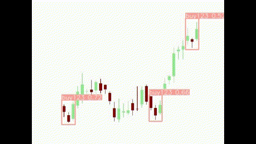

# Stock Market Pattern Detection with YOLO

## This project explores the use of YOLO (You Only Look Once) for detecting candlestick patterns (Pattern 123) in stock market data.

### Project Overview

The project consists of two main parts:

### 1. Data Preprocessing (img2vid.ipynb):

  - Downloads historical stock data for a specific ticker symbol using `yfinance`.
  - Converts the data into a visual representation using matplotlib. Up and down bars are colored differently to highlight price movements.
  - Saves each data window as a separate image file.
  - Creates a video by combining the image frames using OpenCV.

### 2. Pattern Detection with YOLO (run_yolo.ipynb):

  - Utilizes the `ultralytics` library for YOLO implementation.
  - Trains a new YOLO model from scratch (comment out this line if you have a pre-trained model for candlestick patterns). You'll need to replace `/content/drive/MyDrive/yolov8_trade/data.yaml` with the path to your custom data configuration file.
  - Detects patterns in the generated video (`itub_candles.mp4`) using the trained model.

**Note:** This is a basic implementation and requires further development for robust pattern detection.

#### Dependencies
`yfinance`
`matplotlib`
`tqdm`
`opencv-python`
`ultralytics (https://github.com/ultralytics)`

#### Running the Project
1. Install the required libraries.
2. Download the stock data by modifying the ticker symbol in `img2vid.ipynb`.
3. Train the YOLO model in `run_yolo.ipynb` (if needed). Adjust paths as necessary.
4. Run the detection script in `run_yolo.ipynb`.
The script will generate a video `itub_candles.mp4` containing the stock data with potential patterns highlighted by the YOLO model (depending on the training data).

#### Further Development
- Train the YOLO model on a dataset of labeled candlestick patterns.
- Refine the data preprocessing step to extract relevant features beyond just open/close prices.
- Integrate the pattern detection results into a trading strategy or visualization tool.
  
This project provides a starting point for exploring YOLO in stock market pattern recognition. With further development, it could potentially be used as an assistive tool for traders.
